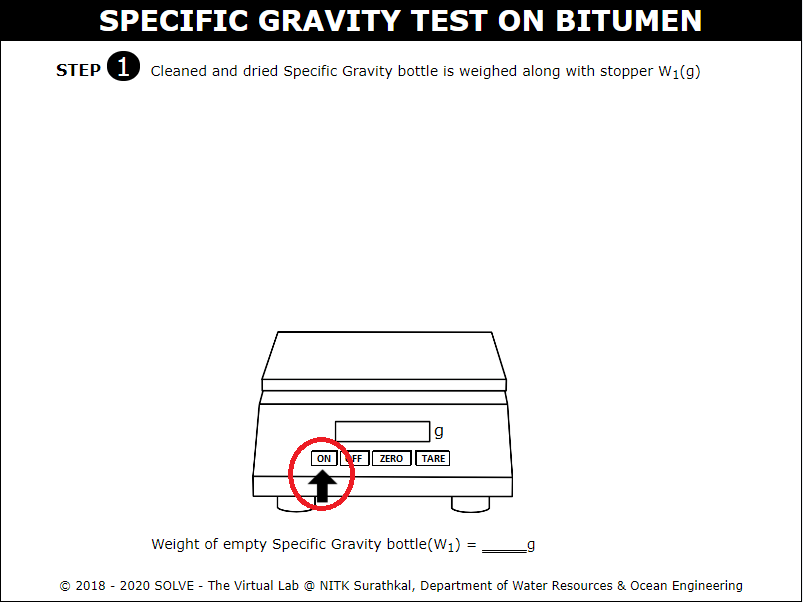
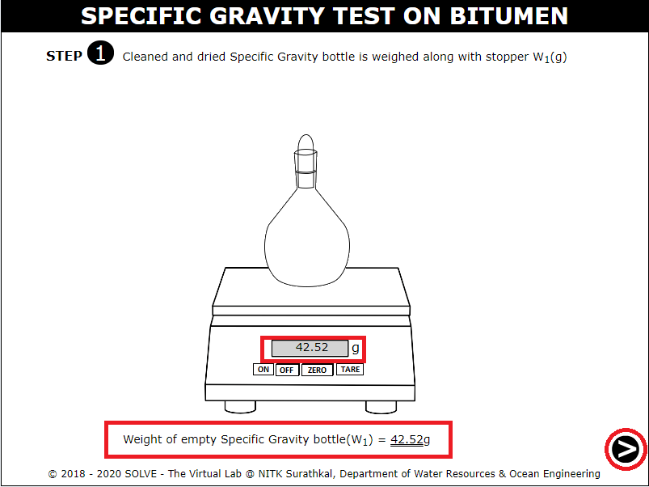
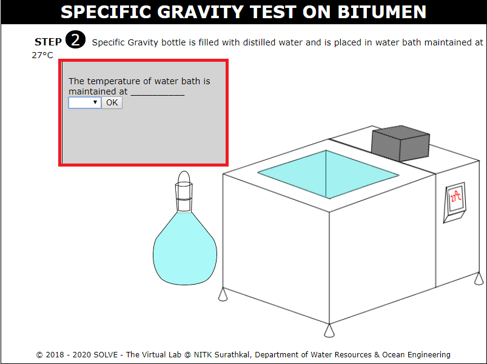
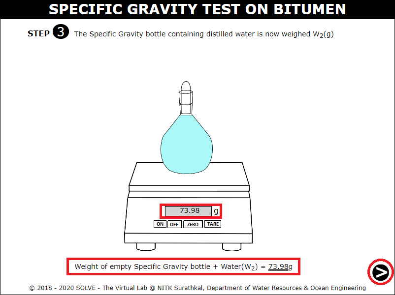
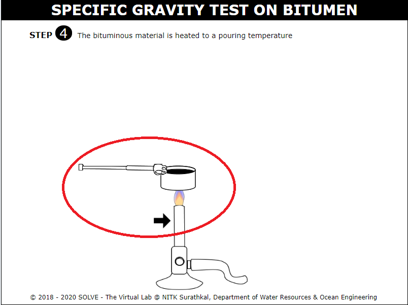
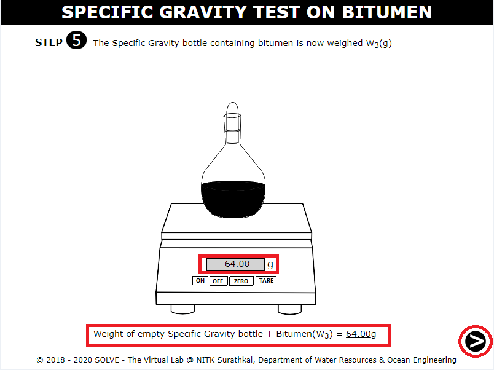
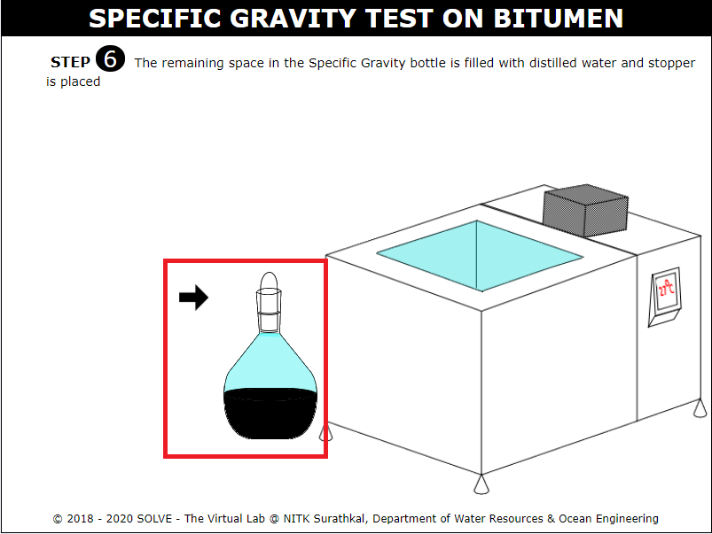
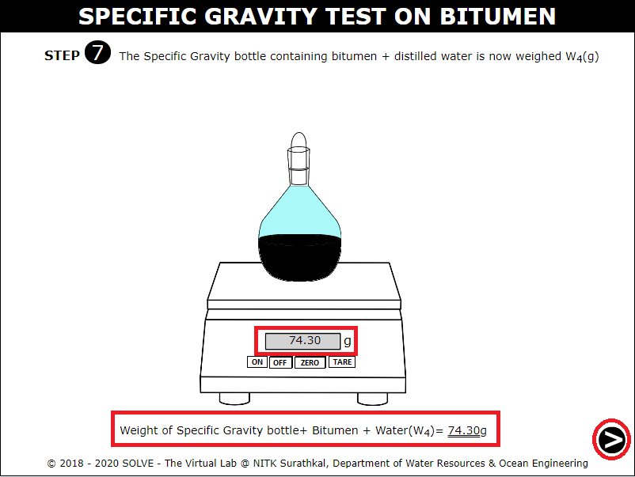
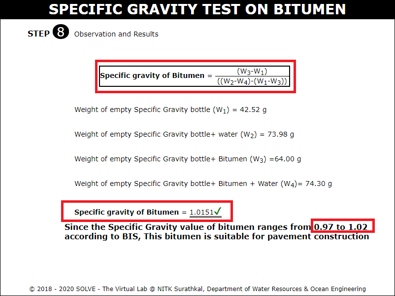

##### These procedure steps will be followed on the simulator

1. When you click on Specific Gravity test on bitumen file, a new window will open as shown below, click on description button to see the definitions, click on the NEXT1 button at the bottom right corner to move to the next step. 
 

2. Click on ON button to weigh the specific gravity bottle. 
 

3. Click on the empty specific gravity bottle to weigh it W1(g), click on NEXT button to proceed. 
 

4. Select the correct answer to proceed, then place the specific gravity bottle in water bath maintained at 27⁰C. 
 

5. Click on the specific gravity bottle containing distilled water to weigh it using weighing machine W2(g), click on NEXT button to proceed. 
 

6. Click on the bitumen to heat it to pouring temperature using Bunsen burner. 
 

7. Click on the specific gravity bottle containing bitumen to weigh it and obtain the weight W3(g), click on NEXT button to proceed. 
 

8. Specific gravity bottle containing bitumen is filled with distilled water and then placed in water bath maintained at 27&deg;C. 
 

9. Weigh the specific gravity bottle to obtain the weight W4(g), click on NEXT button to proceed. 
 

10. Note down the observation and obtain the required result and go through the inference. 
 
