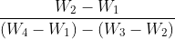
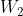
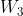
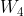

### INTRODUCTION 

Bitumen is the residue or by-product obtained by the refining of crude petroleum. A wide variety of refining techniques like straight distillation technique, solvent extraction technique etc are used to produce bitumen of different consistency and other desirable properties. Depending on the origin and other characteristics of the crude oils and property of bitumen required, more than one processing method may be employed. The type of construction decides the type of bitumen needs to be used. But in general good bitumen should have following properties.

<ol style="text-indent:25px; text-align:justify;list-style-position: inside">
<li><strong>Temperature susceptibility of bitumen</strong>: the bitumen mix should not become too soft or unstable during hot weather, and not become too brittle during cold weather.</li>

<li><strong>Viscosity of the bitumen</strong>: at the time of mixing and compaction should be adequate. This can be managed by the use of cutbacks or emulsions of suitable grades or heating the bitumen and aggregates prior to mixing.</li>

<li><strong>Affinity and adhesion of bitumen</strong>: There should be adequate affinity and adhesion between the bitumen and aggregates used in the mix.</li>
</ol>

In pavement constructions density property of binder is in great use to classify a binder and its quality. In general use the weight of the bitumen is converted into volume using density values when it is used with aggregates. The density of bitumen indirectly conveys the quality of bitumen as it is greatly influenced by its chemical composition. Increase in aromatic type mineral impurities cause an increase in specific gravity. Therefore it is important to know the specific gravity of run and cut-back bitumen to understand the rate of spread, volumetric conversion of mix design etc. Specific gravity of bitumen is expressed as the ratio of the mass of a given volume of the material at 25&deg;C to that of an equal volume of water at the same temperature. The specific gravity of pure bitumen ranges from 0.97 to 1.02 according to Indian standard (BIS) minimum specific gravity of paving bitumen at 27&deg;C shall be 0.99 for grades A25, A35, A45, A65, S35, S45 and S65, 0.98 for A90 and S90 and 0.97 for A200. The higher specific gravity will be obtained if the bitumen contains mineral impurities. Specific gravity is obtained as,

Specific Gravity = 

= Empty weight of pycnometer

 = Empty weight of pycnometer + Bitumen

 = Weight of pycnometer+ Water+ Bitumen

 = Weight of pycnometer+ Water

<strong>Relevant Indian Standard for Specific Gravity Test on Bitumen</strong>:

IS 1202-1978 Edition 2.2 (2004-10): Methods for Testing Tar and Bituminous Materials: Determination of Specific Gravity (First Revision).

